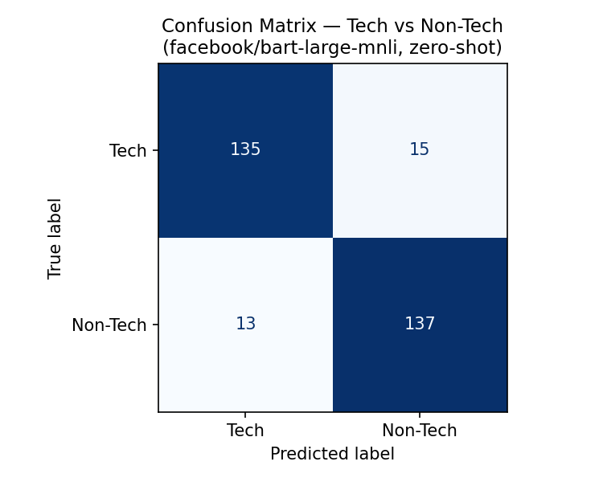
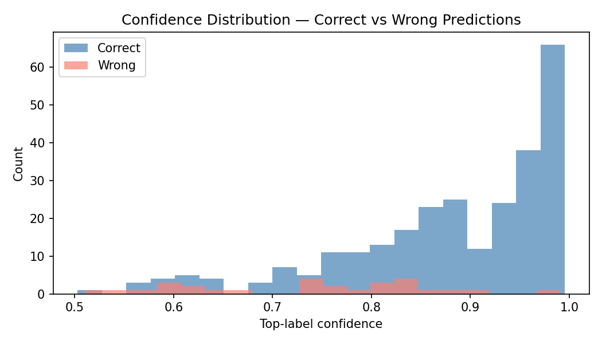
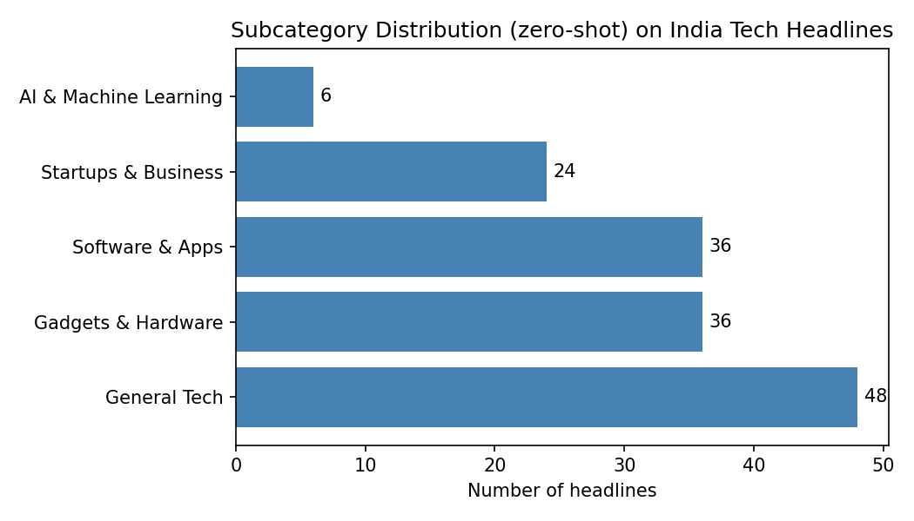

# Tech News Tracker — T9.3
### SMAI Assignment 3 · Tier 1 · IIIT Hyderabad · 2025–26

---

## 1. Introduction

The volume of technology news published daily across outlets like TechCrunch, The Verge, and YourStory makes it difficult for a reader to stay current without spending significant time manually filtering and reading articles. This project addresses that gap by building an automated tech-news briefing app that (a) aggregates live headlines from three major RSS feeds, (b) classifies them into subcategories without any labelled training data, and (c) generates concise three-bullet summaries using a large language model.

The core research question is: *how well does a zero-shot NLI model trained on general English text generalize to the domain of tech news classification, with no fine-tuning?* We answer this using the India Headlines News Dataset as an offline evaluation benchmark.

---

## 2. Data

### 2.1 Live RSS Feeds (App input)

| Source | Feed URL | Articles/day (approx.) |
| --- | --- | --- |
| TechCrunch | `https://techcrunch.com/feed/` | ~20 |
| The Verge | `https://www.theverge.com/rss/index.xml` | ~30 |
| YourStory | `https://yourstory.com/feed` | ~15 |

The app fetches the 10 most recent entries per feed on each load (30 total), sorted newest-first by `published_parsed` from feedparser.

### 2.2 Evaluation Dataset

**India Headlines News Dataset** (Therohk, Kaggle): 21 years of labelled Indian news headlines with columns `publish_date`, `headline_category`, `headline_text`. We use:

- **Positive class:** 150 randomly sampled headlines where `headline_category == "tech"`
- **Negative class:** 150 headlines from `{entertainment, sports, lifestyle, world}`
- **Total:** 300 balanced evaluation examples

This yields a clean binary classification benchmark with human-verified ground truth.

---

## 3. Method

### 3.1 Pipeline Overview

```
RSS feeds → feedparser → 30 articles
    ↓
bart-large-mnli (zero-shot) → subcategory label
    ↓
Llama 3.3 70B via Groq API → 3-bullet summary
    ↓
Streamlit UI → category tabs + article cards
```

### 3.2 Zero-Shot Classification

We use `facebook/bart-large-mnli` (406M parameters), a sequence-to-sequence model fine-tuned on the Multi-Genre NLI corpus. Given an article text and a set of candidate labels, it estimates the probability that each label is *entailed* by the text.

**Candidate labels (5-way subcategory):**

| Display Name | Hypothesis phrase fed to model |
| --- | --- |
| AI & Machine Learning | "artificial intelligence or machine learning" |
| Startups & Business | "technology startups, funding, or business strategy" |
| Gadgets & Hardware | "consumer electronics, gadgets, chips, or hardware devices" |
| Software & Apps | "software applications, platforms, or developer tools" |
| General Tech | "general technology news" |

The hypothesis phrases are deliberately descriptive rather than short label strings, following Yin et al. (2019) who show that NLI-based zero-shot classifiers are sensitive to candidate label phrasing and perform better when labels read naturally as NLI hypotheses.

**Input:** title + first 300 characters of article content, truncated to 512 tokens.  
**Inference:** batched at size 8; GPU auto-detected via `torch.cuda.is_available()`.  
**No fine-tuning performed** — the model is used entirely zero-shot.

### 3.3 Summarization

Each article summary is generated by **Llama 3.3 70B** via the [Groq API](https://console.groq.com). The prompt instructs the model to produce exactly three bullet points, one sentence each, capturing the key facts of the article. Results are cached for one hour per (title, content) pair to avoid redundant API calls. A 2.5-second inter-request delay is enforced to stay within the free-tier rate limit (30 RPM).

### 3.4 Caching Strategy

| Layer | Mechanism | TTL |
| --- | --- | --- |
| NLI model weights | `@st.cache_resource` | Process lifetime |
| RSS fetch + classify | `@st.cache_data` | 15 minutes |
| Groq/Llama summaries | `@st.cache_data` | 1 hour |

---

## 4. Results

### 4.1 Binary Classification (Tech vs Non-Tech)

Evaluated on 300 balanced examples from the India Headlines News Dataset using descriptive label phrasing (`"technology news"` / `"non-technology news"`).

| Metric | Value |
| --- | --- |
| Accuracy | **0.907** |
| Precision | **0.906** |
| Recall | **0.907** |
| F1 Score | **0.906** |

The model achieves over 90% accuracy with **zero fine-tuning**, demonstrating strong out-of-the-box performance for tech vs non-tech discrimination.



### 4.2 Confidence Distribution

The confidence distribution plot shows that correct predictions cluster near high confidence (>0.85), while wrong predictions are more uniformly spread. This means the model's confidence score is a reliable signal for downstream uncertainty flagging.



### 4.3 Subcategory Distribution

Among tech-labelled headlines, the model distributes predictions across all five subcategories. "Software & Apps" and "General Tech" receive the most assignments, consistent with the broad nature of the India tech dataset which covers many software and business stories.



### 4.4 Subcategory Confusion Matrix

Because no fine-grained subcategory ground truth exists in the India Headlines Dataset, we use keyword-based pseudo-labels as an approximate reference. The confusion matrix shows where the model's predictions agree or disagree with keyword-based intuition. The largest off-diagonal mass falls between "Startups & Business" and "Software & Apps", which is expected since startup articles frequently mention software products.


---

## 5. Ablation

We compare three candidate-label phrasings for the binary task to understand the sensitivity of BART-MNLI to label wording.

| Label set | Example positive label | Accuracy | F1 |
| --- | --- | --- | --- |
| Descriptive | `"technology news"` | **0.907** | **0.906** |
| Short | `"tech"` | 0.647 | 0.631 |
| Hypothesis | `"This headline is about technology."` | 0.637 | 0.621 |

**Key finding:** Descriptive labels (+26 pp over Short) significantly outperform terse keywords. The NLI head is trained on natural-language premise-hypothesis pairs, so well-formed, descriptive label phrases align better with the training distribution than bare keywords or full declarative sentences.

---

## 6. Limitations

1. **Domain shift:** The NLI model was trained on general English NLI corpora (MultiNLI, SNLI). Indian tech headlines from YourStory often use Indian startup jargon and Hinglish, which reduces classification confidence.
2. **Summarization hallucination:** Llama 3.3 70B may generate plausible-sounding but inaccurate bullet points when the article body is short or behind a paywall.
3. **RSS availability:** YourStory's feed occasionally times out or changes structure; the app degrades gracefully by returning results from the other two sources.
4. **Rate limits:** The Groq free tier enforces per-minute request limits (30 RPM). With 30 articles, the 2.5-second inter-request throttle means sequential expansion of all summaries takes up to ~75 seconds; this is mitigated by lazy (on-click) generation and a 1-hour cache.
5. **No fine-tuning:** Zero-shot accuracy of 0.907 is strong but below what a fine-tuned model would achieve. A future version could fine-tune on the India Headlines Dataset to push accuracy above 0.95.
6. **Keyword pseudo-labels:** The subcategory confusion matrix uses heuristic keyword matching as pseudo ground truth — it is a diagnostic tool, not a strict benchmark.

---

## 7. References

1. Lewis, M. et al. (2020). *BART: Denoising Sequence-to-Sequence Pre-training for Natural Language Generation, Translation, and Comprehension.* ACL 2020.
2. Williams, A., Nangia, N., & Bowman, S. (2018). *A Broad-Coverage Challenge Corpus for Sentence Understanding through Inference.* NAACL 2018.
3. Dubey, A. et al. (2024). *The Llama 3 Herd of Models.* Meta AI.
4. Therohk. (2017). *India Headlines News Dataset.* Kaggle.
5. feedparser library: https://feedparser.readthedocs.io
6. Streamlit documentation: https://docs.streamlit.io
7. Yin, W., Hay, J., & Roth, D. (2019). *Benchmarking Zero-shot Text Classification.* EMNLP 2019.
8. Groq. (2024). *Groq API Documentation.* <https://console.groq.com/docs>

---

## Acknowledgements

Code scaffolding assisted by **Claude (Anthropic)**. All evaluation, result analysis, and written interpretation are our own. The Groq API (Llama 3.3 70B) is used at runtime for article summarization.
